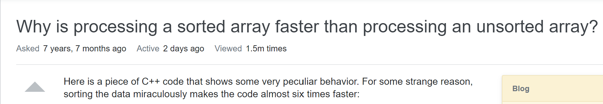

## Smart Questions are Important

Smart questions are essential for smart software engineers because it cuts down the time of looking up useless information or having to deal with answering questions that can be found in the frequently asked questions (FAQs) section.  As Eric Steven Raymond states in How to Ask Questions The Smart Way, “If you decide to come to us for help, you don’t want to be one of the losers”. When Raymond says “losers” he is referring to people who do not do their own work and ask questions to just get an answer before they try themselves to get the answer. When a “dumb” question is asked by said loser, it frustrates many hackers who answers these questions on StackOverflow because they do not want to spend their time answer questions that are easily found on the internet instead they want to be challenged with a hard, or smart, question. Smart software engineers may become hostile to “losers” because they are challenged intellectually and do not want to keep answering “baby” questions. 

## Example of a Smart Question

An example of a smart question is shown below. This question was asked once the user did their own research and still could not find the answer. As seen in the image, they wrote their own code, took out certain lines of code and compared the amount of time it took each round. This user was confused in why the program was doing this particular act. After writing it in C++, the user wrote the same code in Java and realized that the code ran the same way no matter what language it was in. The user had initial thoughts but could not find the answer on the internet, which is why they turned to StackOverflow as their last option. This type of thought process is the way a smart question should be asked and what smart software engineers look for. 
  

  

The responses to this question are not shown but one of the responses were very informative and help the user understand their program much better.  The answer given gave a definition of the type of behavior that was occurring, examples to back up their main point, and many different reasons why this behavior occurs. The answer was very detailed and shows the reader how knowledgeable the “hacker” is behind the screen. This example is how a smart question should be asked and how it should be answered. 

## Insights Gained

