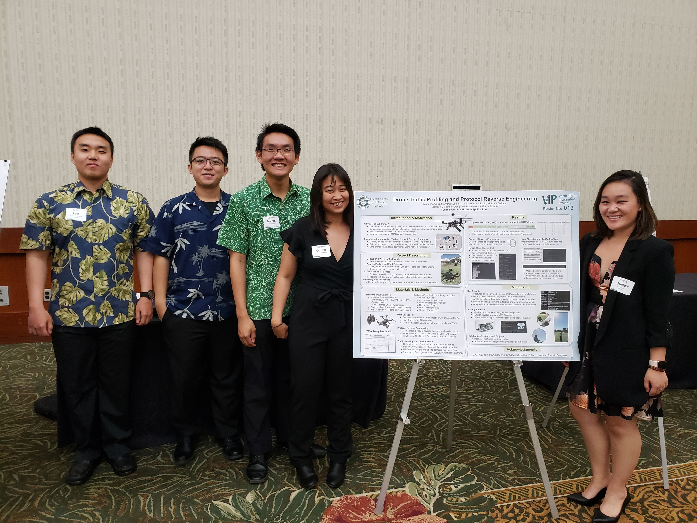

  
  

Drones provide many new opportunities to develop new applications such as Unmanned Aerial Systems (UASs) that have become versatile and effective tools for malicious users. UASs has also made it possible for remote surveillance and kinetic strikes. Due to these attacks and malicious users there is a growing need for wireless network security solutions. This project focuses on classifying drones by their unique frame breakdown of wireless protocols, determine the type of drones based on analysis of Wi-Fi packet samples, and then land a drone with artificial commands using the network "fingerprint".

My team and I planned out three different steps to get to our end goal. The first step was to collect UAS Wi-Fi traffic packets which would help us examine the communication between a drone and its controller. The second step was to analyze the packets and find patterns. In this step we needed to decrypt data from the packets then, analyze the packet data trends for patterns and finally conduct reverse engineering communication protocols. The last step was to inject artificial packet which means the packets were created by using previously determined protocol formats.

In this project I was responsible for collecting packets from the various drones and help analyze the packets to find patterns. Through this project I learned how difficult drones can be to fly and the work that is each member must put in if we want to reach our end goal. I am currently still working on this project and we are in the process of analyzing all the different packets we collected from three different drones. Packet collection may sound simple to most people, but there is a lot of work that must be put in to complete this task. Flying the drone is not the only step that is needed to collect packets. This project not only taught me how difficult drones can be but it also has taught me team work. Through the work each of my team members puts in for this project, we have accomplished many of our small goals. 

You can learn more at the [UH Cyber Security and Application Research Group](https://sites.google.com/a/hawaii.edu/uh-uas-projects/research/2020-x96-projects).
