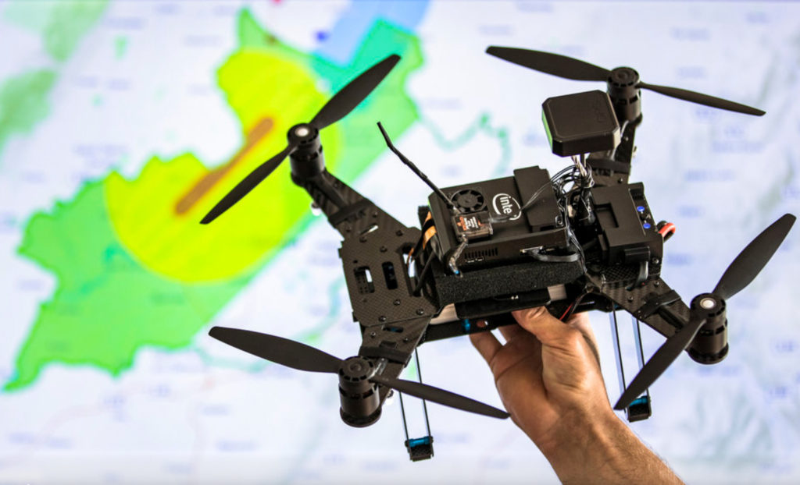

  
  

Drones provide many new opportunities to develop new applications such as Unmanned Aerial Systems (UASs) that have become versatile and effective tools for malicious users. UASs has also made it possible for remote surveillance and kinetic strikes. Due to these attacks and malicious users there is a growing need for wireless network security solutions. This project focuses on classifying drones by their unique frame breakdown of wireless protocols, determines the type of drones based on analysis of Wi-Fi packet samples, and the land a drone with artificial commands using the network "fingerprint".

My team and I planned out three different steps to get to our end goal. The first step was to collect UAS Wi-Fi traffic packets which would help us examine the communication between a drone and its controller. The second step was to analyze the packets and find patterns. In this step we needed to decrypt data from the packets then, analyze the packet data trends for patterns and finally conduct reverse engineering communication protocols. The last step was to inject artificial packet which means the packets were created by using previously determined protocol formats.

You can learn more at the [UH Cyber Security and Application Research Group](https://sites.google.com/a/hawaii.edu/uh-uas-projects/home?pli=1).
