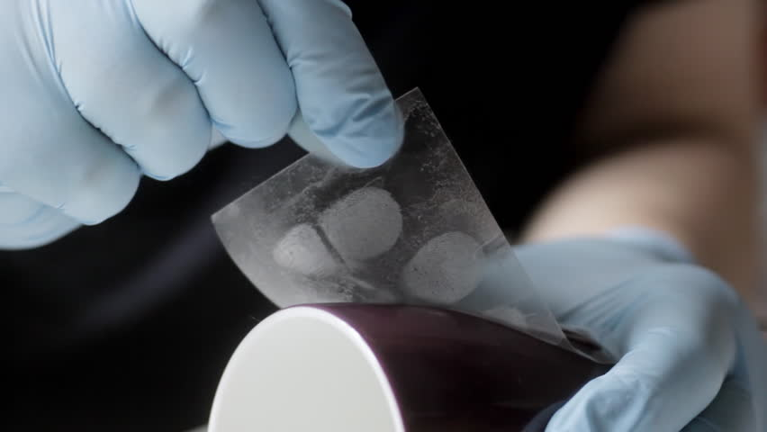

As an intern in the Scientific Investigation Section at the Honolulu Police Department, I was assigned the task of validating the fingerprint procedures used to lift fingerprints from crime scenes. There were four different type of fingerprint procedures that I helped to validate and they were black powder, magnetic powder, fluorescent powder, and adhesive. Each different procedure consisted of several steps to make sure that each different type of material could still be used to lift fingerprints off of several different substrates.

After testing each different type of material and substrate, I wrote a report that helped to validate the procedures for Crime Scene Investigators to later use in the future. 

You can learn more at the [Honolulu Police Department](http://www.honolulupd.org/department/index.php?page=sis).
