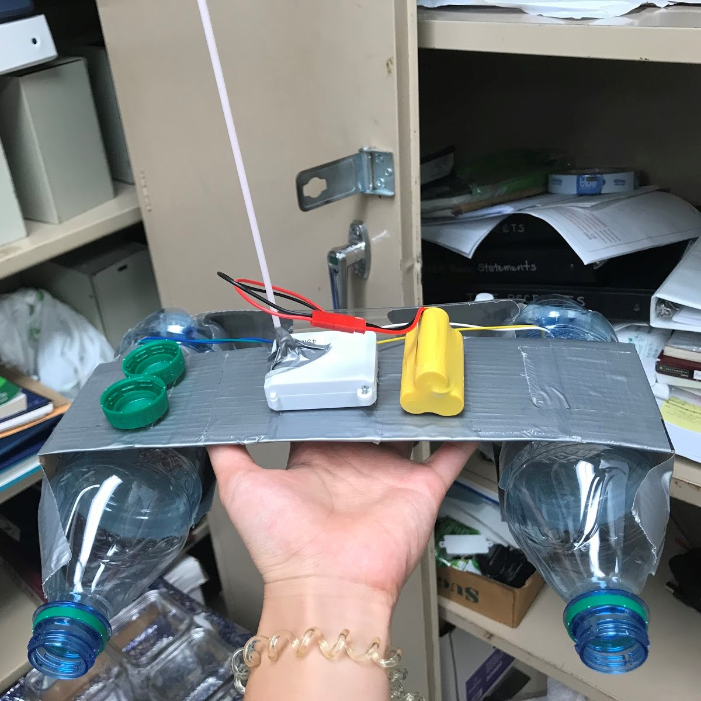
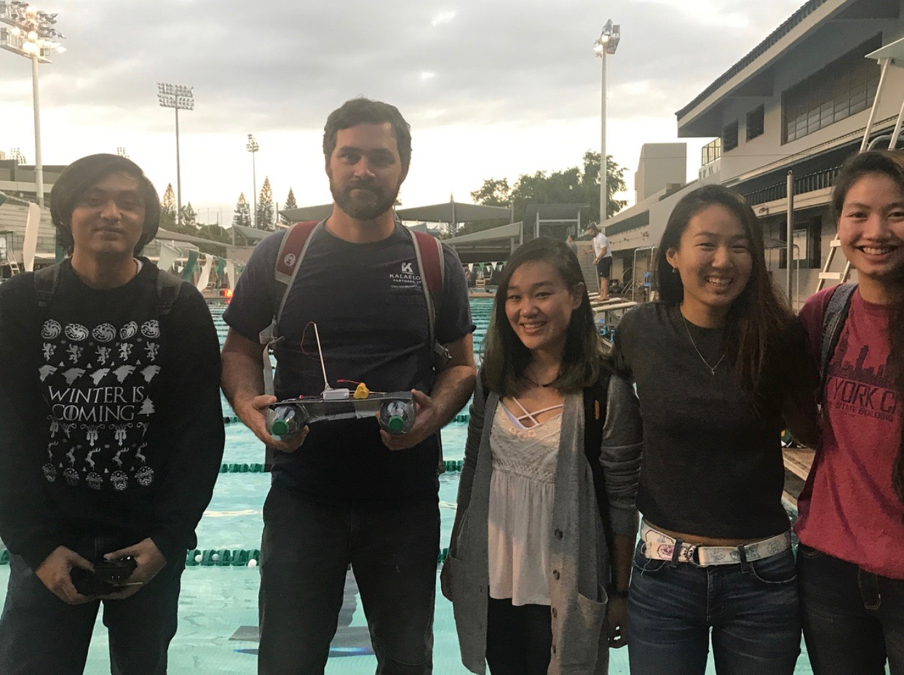
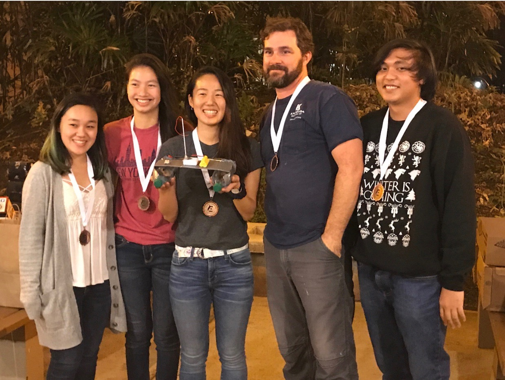

  
  
  

The College of Engineering at the University of Hawaii at Manoa host the "Holmes Hall Freshmen Challenge" every fall for incoming engineering freshmen. This challenge is a competition between teams of incoming freshmen that help them learn and experience the engineering design process under the mentorship of an upperclassmen engineering student. The objective of the challenge is for the team to design, construct, and test a device or system of devices that can retrieve ping pong balls from one end of the pool to the other end.  Each team is judged based on a certain criteria and on their presentation.

My team met every week for the fall 2017 semester and designed a device that we thought would collect enough ping pong balls in the fastest amount of time. We also worked on our PowerPoint presentation to present to the judges and other teams on the day of the competition. Overall my team placed second place out of 8 other teams.
