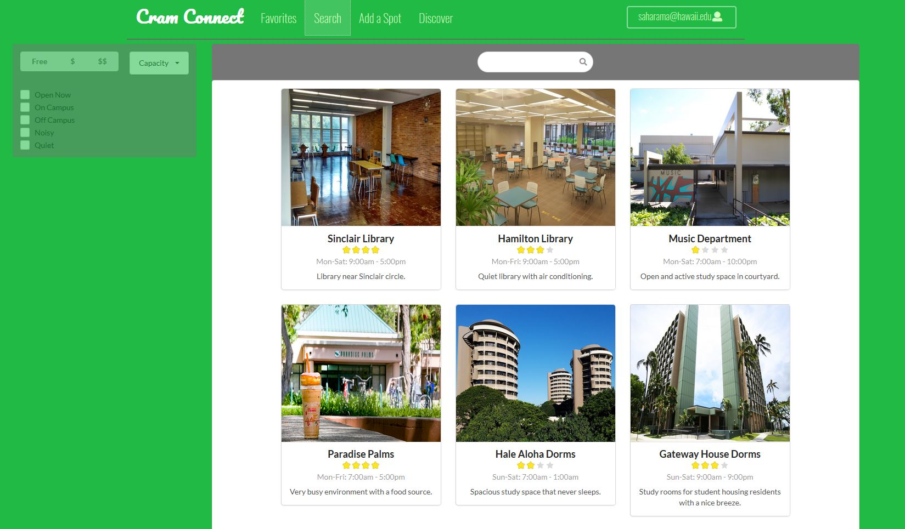

  
  

In ICS 314, the final project for the class was to create a web application in a group of three other people. Our project idea was called Cram Connect. Cram Connect is a website that students at the University of Hawaii at Manoa could use to find a place to study on campus and rate their favorite study spots. Students can create user profiles that list their name, major, favorite spot qualities, and favorite study spots. Each study spot or location listed their hours, a short description, a google map location, and their rating. Our goal for this web application was to provide a intuitive user interface that can provide an efficient system to allow students to discover and rate study spots in and around the University of Hawaii at Manoa campus. 

In our group of four people, we split up the work evenly by using issue driven project management. Issue driven project management is when tasks or issues are assigned to each group member and placed into a milestone with a due date. For issue driven project management, tasks are split up evenly between group members and are spread out over time to not rush group members. Once a milestone is completed, then more issues are created and assigned to each group member.  Through this type of project management, the web application can be tested as the project goes on and group members do not feel rushed.  

The tasks I was assigned was to create the search page and create the favorites page.  The search page became harder than we thought and I had to pass on the favorites page to a different group member. In the search page it showed all the locations created for cram connect and users could search for whatever location they wanted to know about.  Another task I was assigned to was updating the project page with screenshots of our milestones, overview of our project, and how to run our application. After each milestone was completed I would upload screenshots of our progress and an explanation of what we accomplished. Also, on our project page was a user guide to let users know how to use our site. 

You can learn more at the [Cram Connect Project Page](https://cram-connect.github.io/)..

